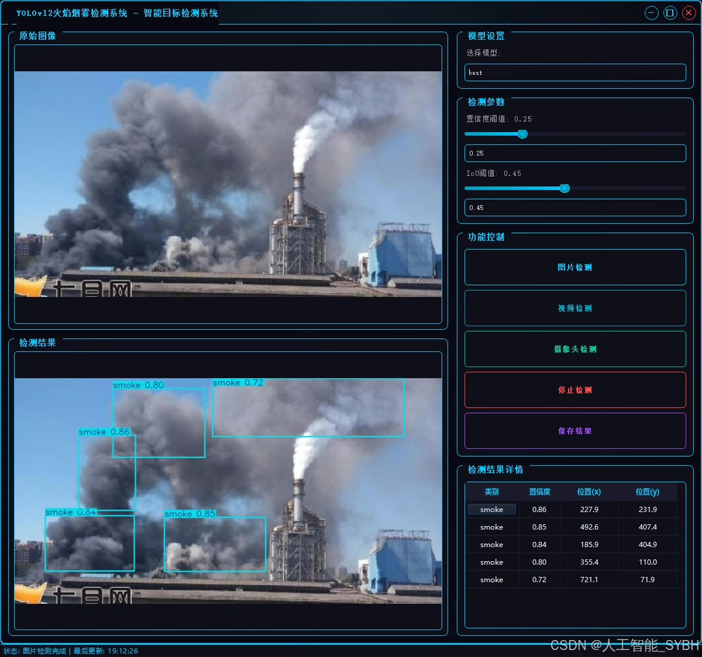
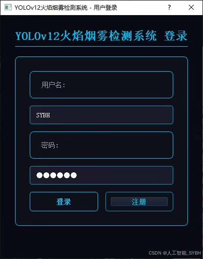
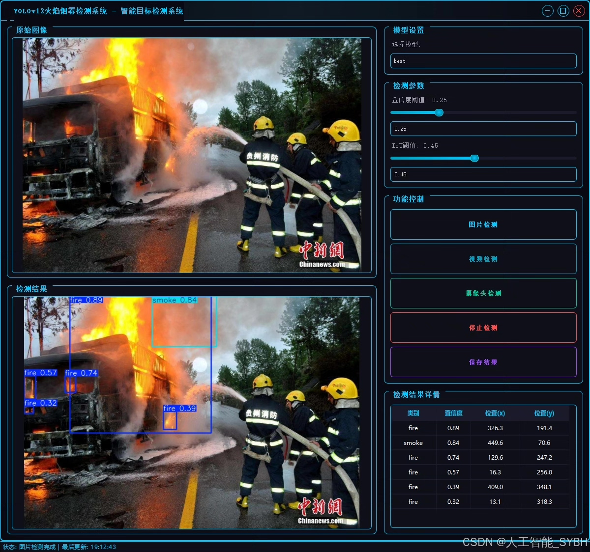
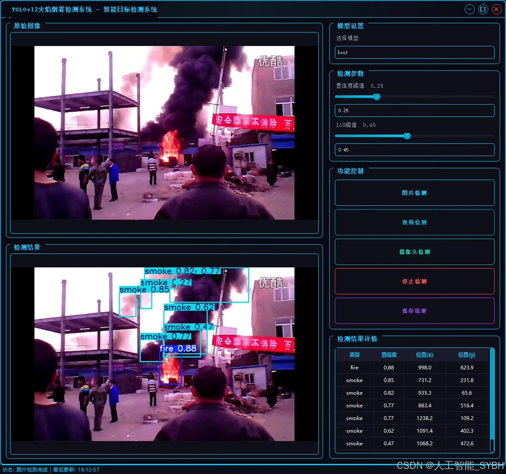
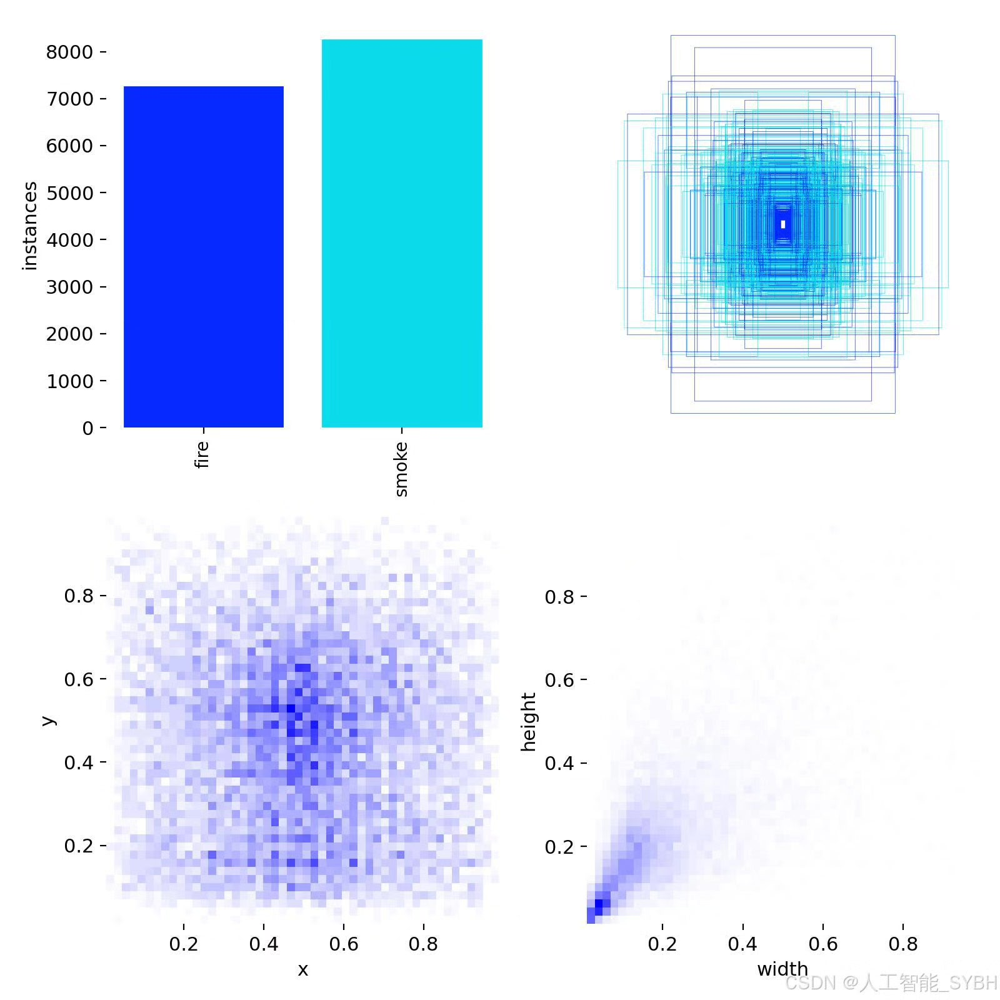
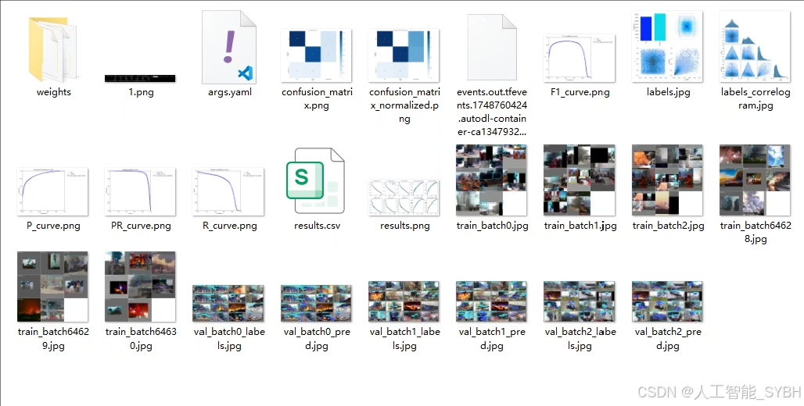
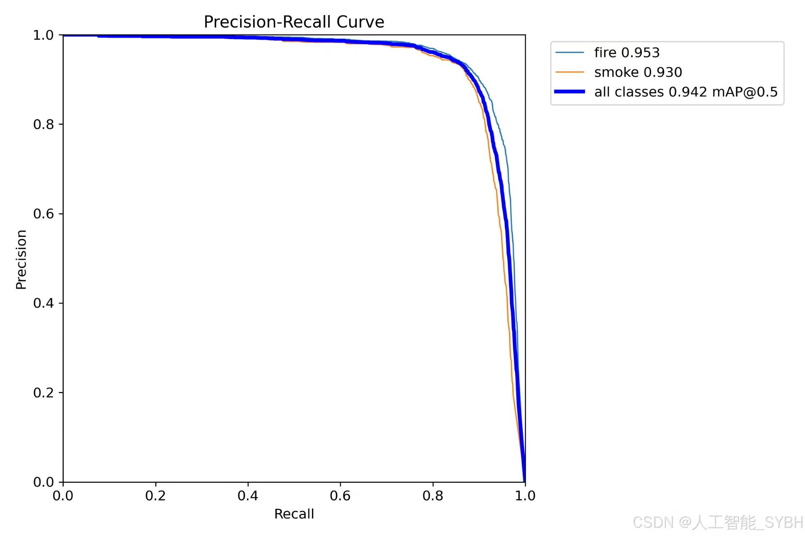
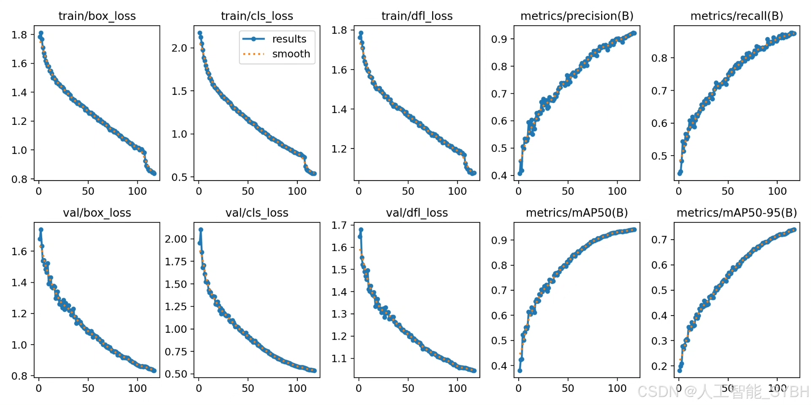
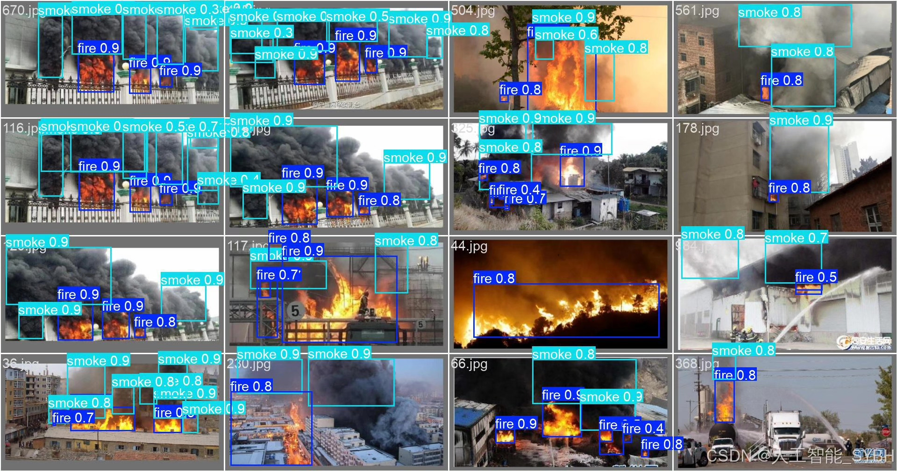

# YOLOv12 flame and smoke detection system

## Body

YOLOv12 Fire and Smoke Detection System Based on Deep Learning YOLOv12 (YOLOv12+YOLO dataset + UI interface + login registration interface + Python project source code + model)

This project has developed an efficient fire and smoke detection system based on the YOLOv12 object detection algorithm, specifically for real-time recognition and localization of flames and smoke in images or video streams. The system features high accuracy and rapid response, which can be widely applied in forest fire monitoring, industrial safety warnings, urban security, and other fields.

Dataset:
nc: 2 classes, named: ['fire', 'smoke'], total image count: training set 4832, validation set 1000, test set 912.

✅ User Login and Registration: Supports password detection and security verification.
✅ Three detection modes: Based on the YOLOv12 model, supports image, video, and real-time camera detection, accurately identifying targets.
✅ Dual-screen comparison: Display original images and detection results on the same screen.
✅ Data visualization: Real-time table displaying the category, confidence, and coordinates of detected targets.
✅ Intelligent parameter adjustment: Offers a confidence slide bar to dynamically optimize detection accuracy, adapting to different scene requirements.
✅ Sci-fi style interactive interface: Dark theme combined with dynamic light effects, reducing visual fatigue and enhancing operational experience.

## Images

## Payment

Here is a pay link on Stripe ( https://buy.stripe.com/3cs8yP7sY87d0vu9AB ). Please contact me lonlonago@foxmail.com after funding $89, and I will send you a complete data files , thank you!

